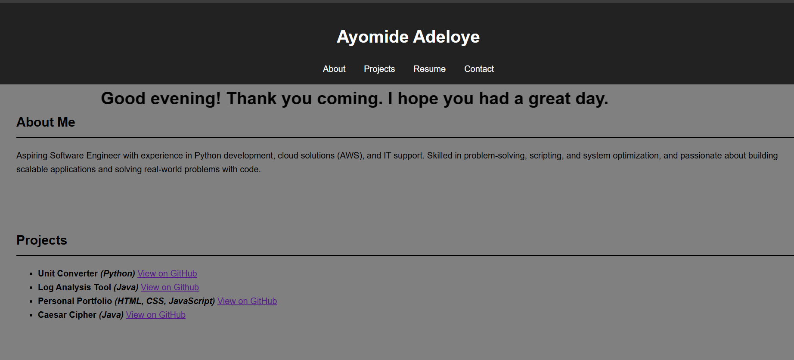

# Personal Portfolio Website

A responsive web application built to showcase projects, technical skills, and GitHub repositories in a centralized platform.

## Live Demo
Deployment in progress

## Preview
## Preview

## Features
- Displays 3+ technical projects
- Responsive design for multiple screen sizes
- Easy navigation with project links
- Direct integration with GitHub repositories

## Technologies Used
- HTML
- CSS
- JavaScript

## Purpose
This project was built to create a professional online presence and provide a central location for showcasing development work.

## How to Run
1. Open the project folder
2. Open the main HTML file in a web browser

## Future Improvements
- Add animations and enhanced UI
- Integrate backend features
- Add contact form functionality
